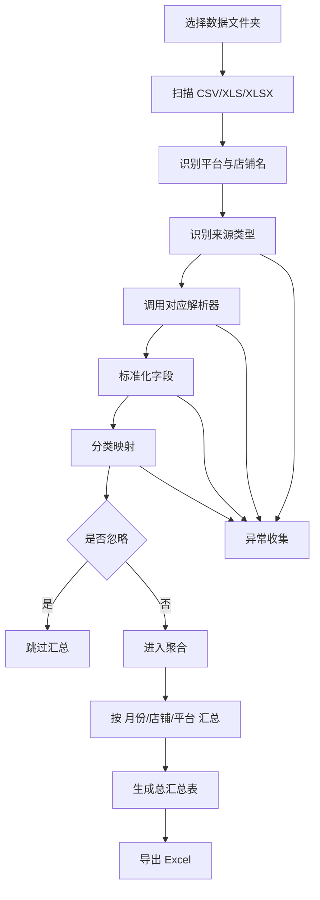

# 开发设计文档 v1

## 项目名称
财务统计小工具

## 文档版本
`v1.0`

## 对应 PRD
`PRD v1.3`

## 文档日期
`2026-04-19`

## 1. 设计目标
本设计文档用于将 PRD 落地为可开发的桌面程序方案，明确系统架构、模块职责、数据结构、解析规则、汇总逻辑和开发顺序。

本期目标是交付一个 `Windows` 单机桌面工具，实现：

- 扫描指定文件夹
- 批量读取 `CSV/XLS/XLSX`
- 识别平台与店铺
- 标准化字段
- 按分类规则映射
- 按月/店铺/平台汇总
- 一键导出仅包含 `总汇总表` 的 Excel

## 2. 技术选型

推荐技术栈：

- `Python 3.11+`
- `PySide6`
- `pandas`
- `openpyxl`
- `SQLite`

选型理由：

- `pandas` 适合做异构表格读取、清洗、聚合统计
- `openpyxl` 适合输出 Excel 报表
- `PySide6` 适合快速构建 Windows 桌面界面
- `SQLite` 适合本地保存配置、规则和运行日志
- 整体单机部署简单，后续维护成本低

## 3. 系统架构

系统采用 4 层结构：

1. `UI 层`
   - 文件夹选择
   - 一键生成报表
   - 运行结果展示
   - 异常提示展示

2. `应用服务层`
   - 调度完整流程
   - 组织导入、解析、映射、汇总、导出
   - 管理异常收集和结果输出

3. `领域逻辑层`
   - 文件名解析
   - 来源识别
   - 字段标准化
   - 分类映射
   - 汇总计算

4. `基础设施层`
   - 文件扫描
   - Excel/CSV 读取
   - SQLite 持久化
   - Excel 导出

## 4. 建议目录结构

```text
finance_tool/
  app/
    main.py
    bootstrap.py

  ui/
    main_window.py
    widgets/
      folder_selector.py
      result_panel.py
      log_panel.py

  services/
    run_report_service.py
    import_service.py
    classify_service.py
    aggregate_service.py
    export_service.py

  parsers/
    base_parser.py
    parser_factory.py
    pdd_csv_parser.py
    tb_xlsx_parser.py

  domain/
    file_name_parser.py
    source_detector.py
    amount_normalizer.py
    remark_normalizer.py
    classifier.py
    aggregator.py

  repositories/
    config_repository.py
    mapping_repository.py
    run_log_repository.py

  models/
    dto.py
    entities.py
    enums.py

  db/
    schema.sql
    sqlite_manager.py

  exporters/
    excel_exporter.py

  utils/
    paths.py
    datetime_util.py
    excel_util.py
    error_util.py
```

## 5. 核心处理流程

系统主流程如下：

```text
选择文件夹
-> 扫描文件
-> 过滤支持格式
-> 逐文件识别来源类型
-> 调用对应解析器读取原始记录
-> 标准化字段
-> 分类映射
-> 过滤忽略记录
-> 聚合汇总
-> 生成总汇总表
-> 导出 Excel
-> 返回执行结果和异常信息
```

可用 Mermaid 表示为：



## 6. 模块设计

### 6.1 UI 模块
主窗口仅保留必要元素：

- 数据目录输入框
- 浏览按钮
- 一键生成报表按钮
- 运行状态文本
- 文件统计信息
- 异常提示列表
- 导出文件路径显示

交互流程：

1. 用户选择目录
2. 点击 `一键生成报表`
3. UI 禁用按钮并显示处理中
4. 服务层执行任务
5. 返回结果后刷新统计信息和导出路径
6. 若有异常，显示异常摘要

### 6.2 文件扫描模块
职责：

- 扫描目录下全部文件
- 过滤支持格式
- 产出待处理文件列表

支持扩展名：

- `.csv`
- `.xls`
- `.xlsx`

输出结构：

- `all_files`
- `supported_files`
- `unsupported_files`

### 6.3 文件名解析模块
职责：

- 从文件名解析 `platform`
- 从文件名解析 `store_name`

示例：

- `3月拼多多—黄小惠米面旗舰店.csv`
- `3月淘宝-庄品健大米1号店（下载）.xlsx`

建议规则：

1. 去除扩展名
2. 去除后缀 `（下载）`
3. 匹配平台关键词
4. 从平台关键词后的分隔内容提取店铺名
5. 若失败则标记 `未知平台`、`未知店铺`

建议接口：

```python
parse_filename(filename: str) -> FileMeta
```

返回：

```python
FileMeta(
    file_name="3月淘宝-庄品健大米1号店（下载）.xlsx",
    platform="淘宝",
    store_name="庄品健大米1号店"
)
```

### 6.4 来源识别模块
职责：

- 判定文件属于哪一种解析模板

当前支持：

- `pdd_csv`
- `tb_xlsx`

识别方式：

- 先看扩展名
- 再看表头特征
- 必要时看 sheet 名

规则示例：

- 若扩展名为 `csv`，且表头包含 `商户订单号,发生时间,收入金额（+元）,支出金额（-元）`，判定为 `pdd_csv`
- 若扩展名为 `xlsx`，sheet 为 `原始数据`，表头包含 `入账时间,商户订单号,账务类型,收入（+元）,支出（-元）`，判定为 `tb_xlsx`

### 6.5 解析器模块
解析器采用工厂模式。

公共接口：

```python
class BaseParser:
    def parse(self, file_path: str, file_meta: FileMeta) -> list[RawRecord]:
        ...
```

#### 拼多多 CSV 解析器
文件结构：

- 第 5 行表头
- 第 6 行开始数据

提取字段：

- `order_no <- 商户订单号`
- `occur_time <- 发生时间`
- `income <- 收入金额（+元）`
- `expense <- 支出金额（-元）`
- `remark_raw <- 备注`
- `biz_desc <- 业务描述`
- `account_type <- 账务类型`

#### 淘宝 XLSX 解析器
文件结构：

- 第 3 行表头
- 第 4 行开始数据
- sheet：`原始数据`

提取字段：

- `order_no <- 商户订单号`
- `occur_time <- 入账时间`
- `income <- 收入（+元）`
- `expense <- 支出（-元）`
- `remark_raw <- 备注`
- `biz_desc <- 业务描述`
- `account_type <- 账务类型`

### 6.6 标准化模块
职责：

- 统一时间
- 统一金额
- 统一字段结构

标准记录结构建议：

```python
NormalizedRecord(
    month="2026-03",
    store_name="庄品健大米1号店",
    platform="淘宝",
    order_no="T200P4502224875038010343",
    amount=-0.20,
    remark_norm="基础软件服务费扣款",
    biz_desc="0030130|软件服务费-基础软件服务费",
    detail_category="基础软件服务费",
    major_category="店铺费用",
    source_file="3月淘宝-庄品健大米1号店（下载）.xlsx",
    source_sheet="原始数据",
    source_type="tb_xlsx",
    ignored=False,
    error_message=""
)
```

#### 时间标准化

- 拼多多：从 `发生时间` 提取 `YYYY-MM`
- 淘宝：从 `入账时间` 提取 `YYYY-MM`

#### 金额标准化
规则：

- 收入有值 -> 正数
- 支出有值 -> 负数
- 两者同时为空 -> 异常
- 两者同时有值 -> 异常

#### 备注归一化
仅淘宝使用强归一化逻辑：

- 去括号里的订单编号、邮箱等动态内容
- 保留业务语义文本

例如：

- `基础软件服务费(2701768802023008263)扣款`
- 归一化为 `基础软件服务费扣款`

### 6.7 分类映射模块
分类策略按平台区分。

#### 淘宝
键规则：

`remark_norm + " —— " + biz_desc`

空值处理：

- 备注空：`[空]`
- 业务描述空：`[空]`

例如：

- `基础软件服务费扣款 —— 0030130|软件服务费-基础软件服务费`
- `[空] —— 0010001|交易收款-交易收款`
- `[空] —— [空]`

映射结果：

- `detail_category`
- `major_category`

特殊规则：

- `[空] —— [空]` -> `ignored=True`
- 不参与汇总

#### 拼多多
优先键：

- `biz_desc`

辅助字段：

- `remark_raw`
- `account_type`

已确认映射包括：

- `0010002|交易收入-订单收入` -> `销售收入 / 资金到账`
- `0010005|交易收入-优惠券结算` -> `销售收入 / 资金到账`
- `0130005|其他收入-申诉补回` -> `销售收入 / 资金到账`
- `0090001|平台补贴-补贴汇入` -> `补贴金额 / 资金到账`
- `0030002|技术服务费-基础技术服务费` -> `基础软件服务费 / 店铺费用`
- `0030023|技术服务费-黑标技术服务费` -> `技术服务费 / 店铺费用`
- `0030003|技术服务费-百亿补贴技术服务费` -> `技术服务费 / 店铺费用`
- `0050002|服务支出-消费者体验提升计划` -> `消费者体验提升计划 / 店铺费用`
- `0060001|营销费用-多多进宝` -> `多多进宝 / 广告费`
- `0020002|交易退款-订单退款` -> `售后退款 / 资金到账`
- `0080001|提现-提现申请` -> `资金提现 / 资金提现`

未命中规则：

- 标记异常
- 不进入汇总，或进入异常待确认列表

建议第一版直接不汇总并提示。

### 6.8 汇总模块
汇总维度：

- `month`
- `store_name`
- `platform`

汇总指标：

- `资金到账`
- `店铺费用`
- `广告费`
- `保证金`
- `资金提现`
- `经营净额`
- `记录数`

`记录数` 定义：

- 指参与当前汇总行统计的原始交易明细条数
- 仅统计成功解析且成功分类的记录
- `忽略` 记录不计入
- 异常记录不计入

实现方式：

- 先按 `major_category` 汇总金额
- 再透视成列
- 最后补充计算列

经营净额公式：

```text
经营净额 = 资金到账 + 店铺费用 + 广告费
```

说明：

- `保证金` 不计入经营净额
- `资金提现` 不计入经营净额
- `忽略` 不参与汇总

建议汇总结果结构：

```python
SummaryRow(
    month="2026-03",
    store_name="庄品健大米1号店",
    platform="淘宝",
    amount_in=12345.67,
    store_cost=-2345.67,
    ad_cost=-888.00,
    deposit=1000.00,
    withdrawal=-5000.00,
    operating_profit=9112.00,
    record_count=2895
)
```

### 6.9 导出模块
仅导出一个 sheet：`总汇总表`

输出列：

- 月份
- 店铺名
- 平台
- 资金到账
- 店铺费用
- 广告费
- 保证金
- 资金提现
- 经营净额
- 记录数

导出要求：

- 数字列保持数值格式
- 标题加粗
- 自动列宽
- 文件名建议带时间戳

建议命名：

```text
财务汇总报表_YYYYMMDD_HHMMSS.xlsx
```

### 6.10 异常处理模块
异常类型建议枚举化：

```python
class ErrorType(Enum):
    FILE_OPEN_FAILED = "文件打开失败"
    UNSUPPORTED_FORMAT = "不支持的文件格式"
    TEMPLATE_NOT_MATCHED = "来源模板未识别"
    FILE_NAME_PARSE_FAILED = "文件名解析失败"
    HEADER_INVALID = "表头不匹配"
    TIME_MISSING = "时间字段缺失"
    AMOUNT_INVALID = "金额字段异常"
    CLASSIFY_NOT_MATCHED = "分类规则未命中"
```

异常处理原则：

- 单条记录异常不影响整文件
- 单文件异常不影响整批
- 所有异常汇总到 UI 展示

结果展示建议：

- 扫描文件数
- 成功文件数
- 失败文件数
- 统计记录数
- 异常记录数
- 导出路径

## 7. 数据存储设计

第一版建议使用 SQLite 保存：

- 软件配置
- 分类映射规则
- 运行日志

### 7.1 配置表 `app_config`
字段：

- `key`
- `value`
- `updated_at`

示例：

- `default_input_dir`
- `default_output_dir`

### 7.2 分类映射表 `mapping_rules`
字段：

- `id`
- `platform`
- `match_key`
- `detail_category`
- `major_category`
- `enabled`
- `created_at`
- `updated_at`

说明：

- 淘宝 `match_key` 存 `备注 —— 业务描述`
- 拼多多 `match_key` 存 `业务描述`

### 7.3 运行日志表 `run_logs`
字段：

- `id`
- `run_time`
- `input_dir`
- `file_count`
- `success_count`
- `failed_count`
- `export_path`
- `status`
- `message`

第一版不强制存储原始明细，因为最终不导出原始明细，内部用 DataFrame 即可。

## 8. 关键类设计

建议核心 DTO：

```python
@dataclass
class FileMeta:
    file_path: str
    file_name: str
    platform: str
    store_name: str

@dataclass
class RawRecord:
    order_no: str
    occur_time: str
    income: str
    expense: str
    remark_raw: str
    biz_desc: str
    account_type: str
    source_file: str
    source_sheet: str
    source_type: str
    platform: str
    store_name: str

@dataclass
class NormalizedRecord:
    month: str
    store_name: str
    platform: str
    order_no: str
    amount: float
    remark_norm: str
    biz_desc: str
    detail_category: str
    major_category: str
    ignored: bool
    error_message: str
    source_file: str
    source_sheet: str
    source_type: str
```

## 9. 主服务编排

建议由 `RunReportService` 负责总流程。

伪代码：

```python
def run(input_dir: str) -> RunResult:
    files = scan_files(input_dir)
    normalized_records = []
    errors = []

    for file in files:
        try:
            meta = parse_filename(file.name)
            source_type = detect_source(file)
            parser = parser_factory.get(source_type)
            raw_records = parser.parse(file.path, meta)

            for raw in raw_records:
                record = normalize_record(raw)
                classify_record(record)

                if record.error_message:
                    errors.append(record.error_message)
                    continue

                if record.ignored:
                    continue

                normalized_records.append(record)

        except Exception as ex:
            errors.append(build_file_error(file, ex))

    summary_df = aggregate(normalized_records)
    export_path = export_summary(summary_df)
    return build_run_result(...)
```

## 10. UI 设计草图

主窗口可简化为：

```text
---------------------------------------------------------
财务统计小工具

数据目录: [ C:\xxx\账单文件夹                     ] [浏览]

[ 一键生成报表 ]

处理结果:
- 扫描文件数: 12
- 成功文件数: 10
- 失败文件数: 2
- 汇总记录数: 8
- 导出路径: C:\xxx\财务汇总报表_20260419_221500.xlsx

异常信息:
1. 文件 xxx.xlsx 表头不匹配
2. 文件 yyy.csv 存在未命中分类规则
---------------------------------------------------------
```

## 11. 开发顺序建议

按以下顺序推进最稳：

1. 搭项目骨架和 UI 主页面
2. 完成文件扫描和文件名解析
3. 完成来源识别
4. 完成拼多多解析器
5. 完成淘宝解析器
6. 完成标准化与金额处理
7. 完成分类映射模块
8. 完成汇总模块
9. 完成 Excel 导出
10. 完成异常展示和配置保存
11. 用真实样本联调

## 12. 测试设计

至少覆盖以下测试：

### 单元测试

- 文件名解析测试
- 备注归一化测试
- 金额标准化测试
- 淘宝组合键分类测试
- 拼多多业务描述分类测试
- 经营净额计算测试

### 集成测试

- 拼多多样本全流程
- 淘宝样本全流程
- 混合目录全流程
- 包含异常文件的目录全流程

### 关键验收点

- 平台、店铺识别正确
- 月份提取正确
- `[空] —— [空]` 不进入统计
- `0080001|提现-提现申请` 进入 `资金提现`
- 只导出 `总汇总表`
- 经营净额不含保证金和资金提现

## 13. 风险与注意事项

1. 文件名规范若不稳定，会直接影响平台和店铺识别。
2. 淘宝备注清洗规则必须固定，否则同类记录可能被拆散。
3. 拼多多后续可能出现新 `业务描述`，需要持续补规则。
4. 若用户未来要求查看明细，当前设计需要补一个“明细查询”能力。
5. `分类映射.xlsx` 后续最好导入数据库，避免代码里硬编码太多规则。

## 14. 后续可扩展方向

1. 增加规则管理页面
2. 增加“预览汇总后再导出”
3. 增加多平台模板
4. 增加导入明细查询
5. 增加按店铺/平台筛选导出
6. 增加自动读取固定目录并批处理
